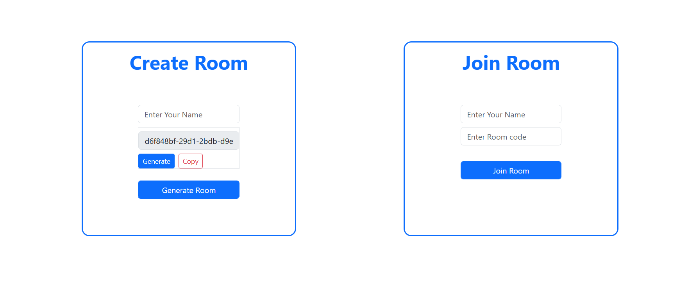
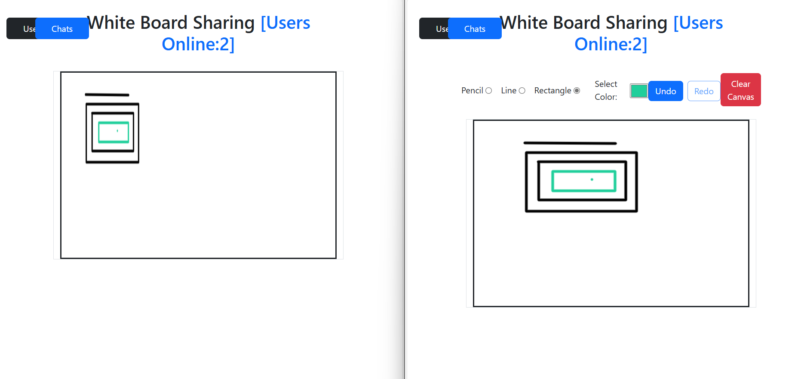
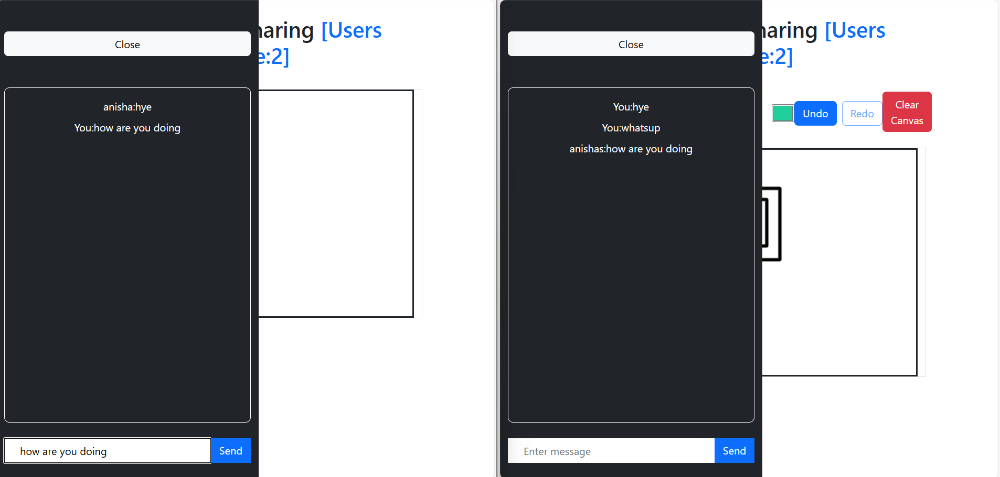

# 🖊️ Real-Time Collaborative Whiteboard

A low-latency, real-time collaborative whiteboard built with **React.js**, **Node.js**, **Express.js**, **Socket.io**, **Canvas API**, and **Rough.js**, allowing multiple users to draw, annotate, and chat simultaneously.

---

## 🚀 Features

- **Multi-user Drawing:** Real-time freehand drawing with smooth client-side rendering.
- **Live Chat:** Enables chat alongside drawing sessions.
- **WebSocket Communication:** Low-latency bi-directional updates via **Socket.io**.
- **Room-Based Sessions:** Allows separate drawing rooms for different user groups.
- **High Concurrency Handling:** Optimized WebSocket event handling for scalability.
- **Freehand Rendering:** Natural hand-drawn effect using **Canvas API** and **Rough.js**.

---

## 🛠️ Tech Stack

- **Frontend:** React.js, Canvas API, Rough.js, HTML, CSS
- **Backend:** Node.js, Express.js, Socket.io
- **Real-time Communication:** WebSocket (Socket.io)

---

## 🧑‍💻 Installation & Setup

### Step 1: Clone the Repository

```bash
git clone https://github.com/yourusername/real-time-whiteboard.git
cd real-time-whiteboard
```
### Step 2: Install and Run Backend (Server)

```bash
cd backend
node server.js
```
### Step 3: Step 3: Install and Run Frontend (Client)

```bash
cd frontend
cd vite-project
npm run dev
```
## 🖥️ Usage Instructions

1. Open: [http://localhost:3000](http://localhost:3000) in your browser.
2. Enter a **Room Name** (or create a new one).
3. Share the **Room Name** with friends or teammates.
4. Start **drawing**, **annotating**, and **chatting** in real-time!

## 📸 Project Preview






 
