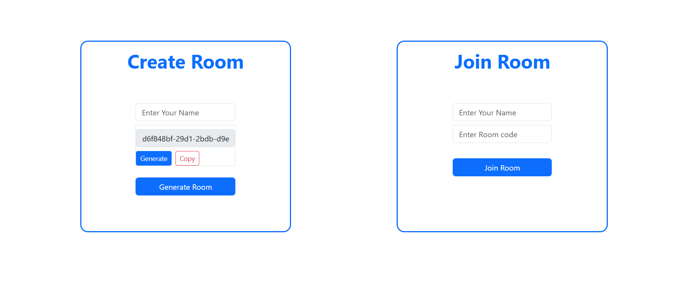
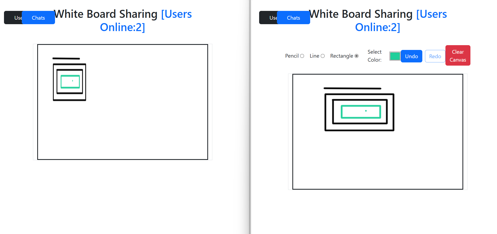
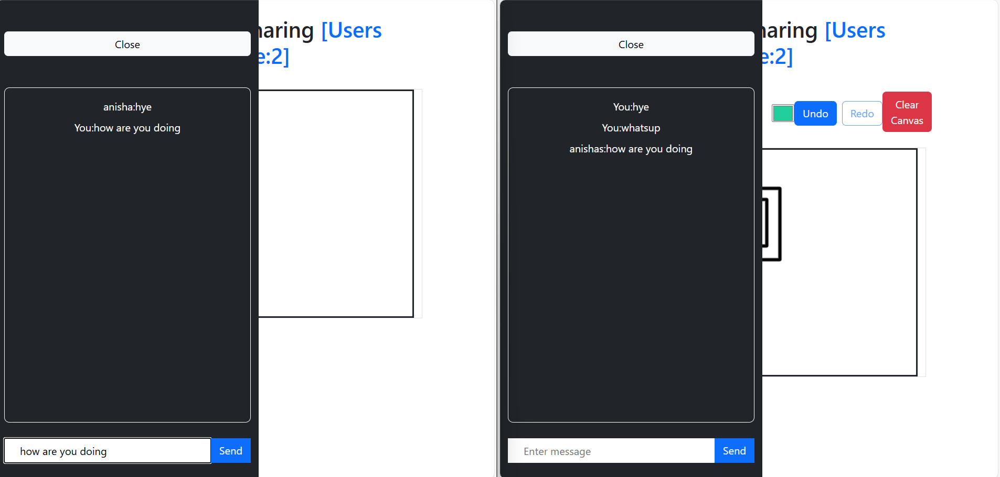

# Real-Time Board Sharing App

This project is a real-time collaborative board-sharing application built using the **MERN** stack (**MongoDB, Express.js, React.js, Node.js**) and **Socket.IO**. It enables multiple users to interact on a shared board simultaneously, facilitating collaborative work and brainstorming sessions.

## Features

- **Real-Time Collaboration**: Users can draw, write, and interact on the board in real-time.
- **User Authentication**: Secure sign-up and login functionalities to manage user sessions.
- **Persistent Data**: Boards and user data are stored in **MongoDB**, ensuring data persistence.
- **Integrated Chat Feature**: Users can communicate with each other in real-time using the built-in chat functionality.

## Technologies Used

### Frontend:
- **React.js**
- **Socket.IO Client**
- **HTML/CSS**

### Backend:
- **Node.js**
- **Express.js**
- **Socket.IO Server**
- **MongoDB**

## Installation & Setup  

**Clone the repository** - `git clone https://github.com/yourusername/lucky-number-game.git`  
**Navigate** - `cd backend` 
**Run backend server** - `node server.js`  
**Navigate** - `cd frontend` 
**Install dependencies** - `npm install`  
**Start the development server** - `npm run dev`  
**Open in the browser** - The application will be accessible at `http://localhost:5173`  

## Preview  

  
  

  
